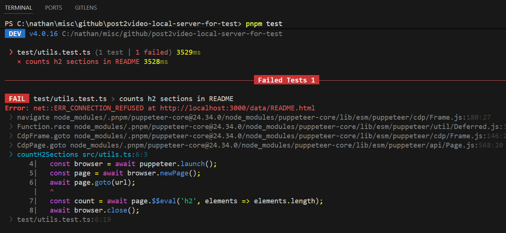
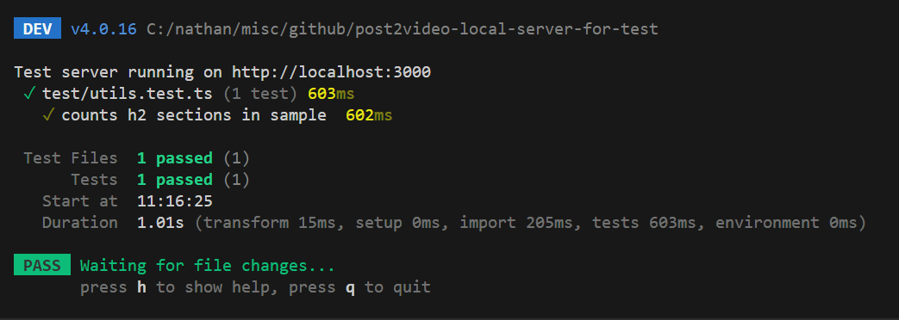

<h1>Project Name</h1>
Static Test Server (Vitest + Puppeteer)

<h2>Project Description</h2>
A lightweight boilerplate for Puppeteer integration testing that bridges the gap between local static files and real-world browser behavior. By leveraging Vitest’s global lifecycle hooks and sirv, this project ensures test data is served over HTTP, maintaining environment parity for security policies, relative navigation, and fetch requests

<h2>Motivation</h2>
While Puppeteer can load local HTML files using the file:// protocol,
this environment differs from real-world browser behavior.
Relative links, navigation between pages, fetch requests, and security
rules behave differently when pages are not served over HTTP.

To enable reliable browser tests across multiple static HTML pages,
the goal was to serve the test files over HTTP using an adequate solution.

<h2>Key Takeaways</h2>
<ul>
  <li>Browser tests should run over HTTP, not file://</li>
  <li>Vitest globalSetup is ideal for one-time test infrastructure</li>
  <li>sirv provides fast, zero-config static serving for test fixtures</li>
  <li>sirv maps local directories to URLs (e.g., test/data → http://localhost:8080/)</li>
</ul>

<h2>Installation</h2>

```bash
pnpm i
pnpx puppeteer browsers install chrome
```

<h2>Usage</h2>

```bash
pnpm test
```

<h2>Technologies Used</h2>
<ul>
<li>puppeteer</li>
<li>vitest</li>
<li>typescript</li>
<li>sirv</li>
</ul>

## Design Options
When serving static files for browser testing, there are multiple viable approaches, each with distinct trade-offs. This section explores four common patterns, evaluates when each makes sense, and provides a recommendation based on the project's requirements.

### 1. In-Process Server — Embedded Node HTTP Server

**Description:** Use Node’s built-in `http` module to serve static HTML files. The server is started and stopped programmatically from the test suite.

#### When to choose

- **Zero Dependencies:** You want to avoid adding third-party packages to the project.
- **Full Control:** You need to customize the server behavior at a granular level.
- **Integrated Lifecycle:** You want the test runner (Vitest) to own the start/stop process entirely.

#### Trade-offs

- **Maintenance:** You are responsible for maintaining the server logic and handling edge cases (like MIME types).
- **Boilerplate:** Requires slightly more initial code to set up the file reading and response handling.

---

### 2. Port Management — External Static Server Command

**Description:** Use a small CLI static server (e.g., `http-server`, `serve`) to host the HTML files and point Puppeteer to `http://localhost`.

#### When to choose

- **Speed of Implementation:** This is the fastest way to move from `file://` to `http://`.
- **CI/CD Compatibility:** Works seamlessly in pipeline environments where a server can be run as a background service.
- **Separation of Concerns:** Keeps the testing logic strictly about testing, not infrastructure.

#### Trade-offs

- **External Lifecycle:** You must ensure the server is killed properly after tests to avoid "Port already in use" errors.
- **Reduced Control:** Configuration is limited to what the CLI tool provides.

---

### 3. The Express-Based Static Server

**Description:** Use Express to serve static HTML files via `express.static`. This allows easy extension later if routes, middleware, or APIs are needed.

#### When to choose

- **Future Growth:** You anticipate moving beyond static files into dynamic content.
- **API Simulation:** You need to mock backend endpoints or test specific HTTP headers and status codes.
- **Middleware Needs:** You want to use existing Express plugins for logging or security headers.

#### Trade-offs

- **Overkill:** Adds significant weight and complexity for a project that may only ever need to serve static HTML.
- **Dependency Management:** Introduces a large dependency tree into your `node_modules`.

---

### 4. Vitest Global Setup + Lightweight Static Server

**Description:**  
Use Vitest’s `globalSetup` and `globalTeardown` hooks to start a lightweight
static HTTP server (e.g., `sirv` or a minimal Node HTTP server) once before
the test suite runs and shut it down after all tests complete.

#### When to choose

- You want the test framework to manage server lifecycle centrally
- You prefer one-time setup instead of per-test hooks
- You want predictable startup and teardown behavior

#### Trade-offs

- Requires familiarity with Vitest global configuration
- Server logic still needs to be implemented or configured
- Ties the setup to Vitest’s execution model

**Note** : Despite the name, this "Global" setup is strictly scoped to a single execution of this specific config file, acting as a one-time orchestrator for all test files in that run.

---

### Summary Table

| Option                              | Dependencies    | Complexity | Control | Lifecycle         |
| ----------------------------------- | --------------- | ---------- | ------- | ----------------- |
| Node HTTP                           | None            | Minimal    | Full    | Manual            |
| CLI Server                          | CLI tool        | Minimal    | Limited | External          |
| Express                             | express         | Medium     | Full    | Manual            |
| Vitest Global Setup + Static Server | sirv (optional) | Low        | Medium  | Framework-managed |

---

### Recommendation

**For most Vitest + Puppeteer projects:** Use **Option 4 (Vitest Global Setup + Static Server)**.
. It provides the cleanest developer experience with automatic lifecycle management and minimal boilerplate.

**If you need zero dependencies:** Use **Option 1 (Node HTTP)**. Perfect for learning projects or when you want complete control without external packages.

**For quick prototyping or CI pipelines:** Use **Option 2 (CLI Server)**. Fastest setup and works well when server lifecycle is managed externally.

**If you plan to add API mocking or dynamic content:** Use **Option 3 (Express)**. Worth the overhead if you know you'll need middleware or custom routes.

---

<h2>Static Server Implementation (sirv)</h2>
<p>
  To implement <strong>Option 4</strong>, this project utilizes <code>sirv</code>. 
  It acts as the bridge between the local file system and the Puppeteer browser instance.
</p>

<h3>Why sirv?</h3>
<ul>
  <li><strong>Zero Configuration:</strong> Automatically handles Content-Type headers for various file extensions (HTML, JS, CSS).</li>
  <li><strong>Performance:</strong> It is significantly faster than Express for static serving, which minimizes test startup latency.</li>
  <li><strong>Middleware Mode:</strong> It can be easily integrated into the Vitest <code>globalSetup</code> lifecycle without spawning separate shell processes.</li>
</ul>

<h3>Configuration</h3>
<p>
  The server is instantiated in the <code>globalSetup</code> hook, ensuring that the 
  entire test suite shares a single HTTP endpoint. This prevents port conflicts and 
  reduces memory overhead during parallel test execution.
</p>

<h2>Code Structure</h2>
 <p>
    The following code snippets demonstrate the core implementation of this boilerplate.
    These files work together to set up the test server lifecycle and provide a simple
    example of Puppeteer-based testing against locally served static content.
  </p>

<h3>utils.ts</h3>

```typescript
import puppeteer from "puppeteer";

export async function countH2Sections(url: string): Promise<number> {
  const browser = await puppeteer.launch();
  const page = await browser.newPage();
  await page.goto(url);
  const count = await page.$$eval("h2", (elements) => elements.length);
  await browser.close();
  return count;
}
```

<h3>utils.test.ts</h3>

```typescript
import { test, expect } from "vitest";
import { countH2Sections } from "../src/utils";

test("counts h2 sections in sample", async () => {
  const PORT = process.env.TEST_PORT || 8080;

  const url = `http://localhost:${PORT}/sample.html`;
  const count = await countH2Sections(url);
  expect(count).toBe(3);
});
```

<h3>vitest.config.ts</h3>

```typescript
import { defineConfig } from "vitest/config";

export default defineConfig({
  test: {
    globalSetup: "./test/global-setup.ts",
  },
});
```

<h3>global-setup.ts</h3>

```typescript
import sirv from "sirv";
import { createServer } from "http";

let server: ReturnType<typeof createServer>;

/**
 * Starts a static HTTP server before all tests run.
 * Defaults to port 8080, but respects PORT env var to avoid collisions.
 */
export async function setup() {
  const PORT = process.env.TEST_PORT || 8080;
  // Maps test/data directory to http://localhost:PORT/
  const assets = sirv("test/data", { dev: true });
  server = createServer(assets);

  await new Promise<void>((resolve, reject) => {
    server.listen(PORT, () => {
      console.log(`Test server running on http://localhost:${PORT}`);
      resolve();
    });

    server.on("error", (err: any) => {
      if (err.code === "EADDRINUSE") {
        console.error(`Port ${PORT} is already in use. Try setting TEST_PORT.`);
      }
      reject(err);
    });
  });
}

/**
 * Stops the static HTTP server after all tests complete.
 */
export async function teardown() {
  await new Promise<void>((resolve) => {
    server.close(() => resolve());
  });
}
```

<h2>Demo</h2>
<p>Without sirv — test error:</p>


<p>With sirv and Vitest — test success:</p>

